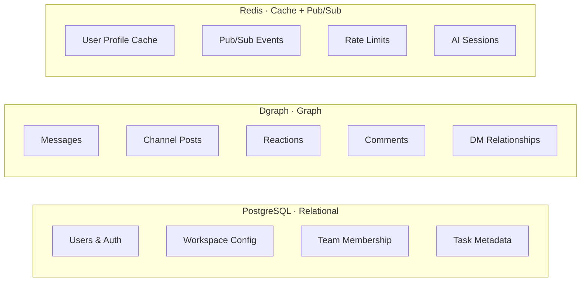

When I mention that OneCamp uses both PostgreSQL and Dgraph, I get one of two reactions:

**Developers:** "Interesting — what's the query pattern that drove that?"

**Everyone else:** "You used two databases for a chat app?"

Both reactions are valid. Let me answer both.

---

## The Setup

OneCamp's data layer looks like this:



**PostgreSQL** handles everything that's relational and queried by primary key: users, authentication, workspace config, team membership.

**Dgraph** handles everything that's graph-shaped and queried by traversal: messages, posts, reactions, comments, DM relationships between users.

**Redis** sits above both as a cache, pub/sub relay, and rate limit store.

---

## Why Not Just Postgres?

Because the chat data is fundamentally a graph.

A DM conversation is an **edge** between N users. A message is an edge from a user to a DM group, carrying a text payload. A reaction is an edge from a user to a message, carrying an emoji. A comment is an edge from a user to a message, which can itself have reaction edges.

In relational terms, querying "give me the last 50 messages in this DM, with their reactions grouped by emoji and comment counts" looks like:

```sql
SELECT 
    m.uuid, m.body_text, m.created_at,
    u_from.user_name, u_from.profile_key,
    COUNT(DISTINCT c.id) as comment_count,
    json_agg(DISTINCT jsonb_build_object(
        'emoji', r.emoji_id,
        'count', r.count,
        'users', r.users
    )) as reactions
FROM messages m
JOIN users u_from ON m.from_user_id = u_from.id
LEFT JOIN comments c ON c.message_id = m.id
LEFT JOIN (
    SELECT message_id, emoji_id, COUNT(*) as count,
           json_agg(u.name) as users
    FROM reactions r2
    JOIN users u ON r2.user_id = u.id
    GROUP BY message_id, emoji_id
) r ON r.message_id = m.id
WHERE m.dm_group_id = $1 AND m.created_at < $2
ORDER BY m.created_at DESC
LIMIT 50;
```

That's the *simplified* version. Add forwarded messages, attachments, soft-delete logic, and mention tracking, and this query gets large enough to need its own unit tests.

In Dgraph (DQL), the equivalent is roughly:

```graphql
{
  dm(func: uid($grp_uid)) {
    dm_chats(orderdesc: chat_created_at, first: 50)
      @filter(lt(chat_created_at, $timestamp)) {
      chat_uuid
      chat_body_text
      chat_from { user_name user_profile_object_key }
      chat_reactions {
        reaction_emoji_id
        reaction_added_by { user_name }
      }
      ~chat_comments { comment_uuid comment_body }
    }
  }
}
```

One query. The database traverses graph edges. No multi-table joins. No aggregate subqueries.

I've maintained SQL queries like the first example in production at Zomato — handling 75k+ daily inquiries on message tables. I've watched them get progressively more painful as data grows: more denormalization, more index tuning, query planner surprises when table statistics drift. The Dgraph approach is a real difference in how readable and maintainable the data access layer stays over time.

---

## Why Not Just Dgraph?

Because Dgraph is bad at things SQL is great at.

**User authentication** — checking credentials, session management, JWT invalidation. These are point lookups on indexed columns. Dgraph's query model is optimized for traversal and aggregation, not "give me the row where email = X."

**Workspace config** — feature flags, billing state, workspace settings. Key-value lookups. Using a graph database here is like using a bulldozer to hang a picture frame.

**Team membership logic** — "is this user a member of this workspace and do they have permission level X?" Three indexed lookups in Postgres, covered by indexes, sub-millisecond. As a Dgraph traversal with edge property predicates — more verbose, harder to optimize, no meaningful advantage.

The principle we settled on:

> **Use Postgres** for stable, relational, write-infrequent data queried by primary key.
> **Use Dgraph** for social graph data: traversal-heavy, write-frequent, queried by relationships.

---

## The Painful Part: Distributed Writes

This is the thing nobody tells you about polyglot persistence upfront. With two databases, every write that affects both requires a **distributed operation** — and distributed operations fail partially.

Consider creating a DM conversation between User A and User B:

```
Step 1: Create DM relationship in Dgraph (edge between users)
Step 2: Record the dm_grouping_id mapping in Postgres

✅ Both succeed → works perfectly
❌ Step 1 fails → nothing persists, user retries, okay
❌ Step 1 succeeds, Step 2 fails → Dgraph knows about the DM, Postgres doesn't
                                   → every query that routes through Postgres misses it
                                   → user never sees their new conversation
```

That last case is the one that keeps you up at night. Dgraph and Postgres are now inconsistent. The system doesn't know. The user's DM just... disappeared.

In OneCamp, we handle this with:
1. Explicit error handling at each step
2. Compensating operations where possible (if step 2 fails, attempt to roll back step 1)
3. Comprehensive logging so inconsistencies are detectable

Is it perfect? No. Is it a source of complexity that lives in the codebase forever? Yes. The distributed write problem doesn't have a clean solution — it has tradeoffs. Two-phase commit exists. It's also brutal to implement and adds latency. For a self-hosted workspace with hundreds of users, we accept that inconsistency is rare and detectable, and that's good enough.

If I were building a SaaS product responsible for thousands of tenants' data, I would think much harder about this before choosing polyglot persistence. For an open-source self-hosted tool, the operational risk is lower — and the query performance gains are real.

---

## The Deterministic Group ID Pattern

One elegant(ish) design that came out of this: **DM group IDs are computed, not stored**.

```go
func GetGroupingId(uuid1, uuid2 string) string {
    uuids := []string{uuid1, uuid2}
    sort.Strings(uuids)
    return strings.Join(uuids, "_")
}
```

The group ID for a DM between User A (`abc-123`) and User B (`xyz-789`) is always `abc-123_xyz-789`. Sort the UUIDs alphabetically, join with underscore. Every time. Without hitting a database.

Why does this matter?

Without deterministic IDs, every time User A wants to send a message to User B, you'd need to look up "does a DM group exist for these two users, and if so, what's its ID?" — a round trip to Dgraph just to find the group ID before you can write the message.

With deterministic IDs, that lookup is a pure function. No database round trip. No race condition between "check if exists" and "create if not exists." Creating a DM group that already exists is idempotent — you arrive at the same ID and Dgraph's upsert semantics handle the rest.

The pattern generalizes to group chats: hash of sorted participant UUIDs. More participants = same principle, slightly larger input. New participant added? New group ID computed from the new participant set. Adding a participant to a group chat is actually *creating a new group* that includes the old participants plus the new one.

---

## Is OpenSearch Also In There?

Yes. The full data layer is:

| Store | Role |
|---|---|
| **PostgreSQL** | Relational core |
| **Dgraph** | Social graph |
| **Redis** | Cache + pub/sub |
| **MinIO** | File storage (S3-compatible) |
| **OpenSearch** | Full-text + k-NN vector search for AI |

Five stores. Each justified. Each also another service that can lag, fail, need a backup strategy, and drift out of sync with the others.

This is the real cost of polyglot persistence: **operational complexity scales with number of data stores, not with the cleverness of your schema**. Every store is a separate failure mode and a separate component to monitor.

For a self-hosted application deployed via Docker Compose, this is manageable. Docker handles the orchestration. The `onemana` CLI handles the configuration. Users get the full stack in one command.

For a SaaS with 1000 tenants where you're on call for every outage — I would weigh this more carefully. The query performance advantages of Dgraph are real, but five data stores means five things that can page you at 3am.

---

## Would I Do It Again?

For the graph queries: **yes**. The message retrieval queries in Dgraph are clearly better than what the equivalent SQL would look like at the same level of feature complexity.

What I'd change: **invest in a better abstraction layer earlier**. Right now, some controllers call Dgraph query functions and Postgres model functions in the same handler. A unified data access layer that presents a consistent interface over both databases would make the distributed write problem more explicit, more testable, and easier to reason about.

The technical debt being: the databases are excellent at their separate jobs, but the seam between them lives in application code — and application code is where complex invariants go to get violated.

---

*All five stores run inside a single Docker Compose stack, spun up with one `onemana` command. [Check out OneCamp at onemana.dev](https://onemana.dev/onecamp-product) or explore the [open-source frontend on GitHub](https://github.com/OneMana-Soft/OneCamp-fe).*
