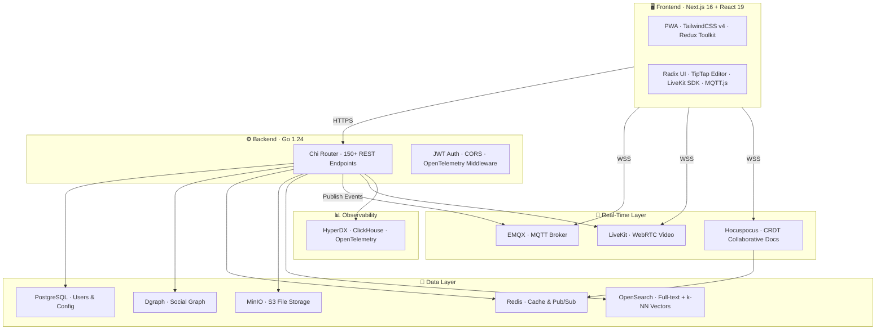
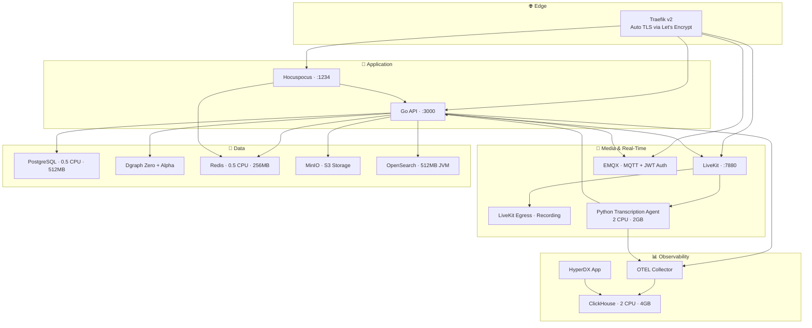

On March 9th, 2026, I launched [OneCamp](https://onemana.dev/onecamp-product).

It's a self-hosted, all-in-one workspace. Chat. Tasks. Docs. Video calls. Calendar. A local AI assistant. All on your own server. One-time payment. No per-seat pricing.

This post is about the year that led to that launch  -  the actual architecture, the real tech decisions, and the most important lesson I learned the hard way. Grab a coffee. This is going to be a long one.

---

## The Itch That Started It 🤔

Early in my career, I worked on large-scale distributed systems. Great teams, genuinely fun problems, real production scale. But every single day I'd open Slack, then Jira, then Notion, then Google Meet, then Google Calendar.

Five apps. Five subscription bills. Five notification systems that don't talk to each other. Five places where context dies.

You finish a task in Jira and have to manually post in Slack that it's done, then update the doc in Notion, then check if the calendar event is still relevant. **Your brain becomes the integration layer.** You're basically a human API.

At some point I thought: *what if one thing just... did all of it?* Chat, tasks, docs, calls, calendar, AI. On YOUR server. One payment. No monthly seat tax. No "we've updated our pricing, sorry 😇" emails every six months.

That's OneCamp. Here's how I built it.

---

## The Full System Architecture 🗺️

Let me show you what this actually looks like before I explain any of it:



Yeah. That's... a lot of boxes. Each one is justified. Let me walk through them.

---

## The Backend: One Go Binary 🦫

The entire backend is **Go 1.24**, compiles to a single binary, and runs with a **Chi router** serving 150+ REST endpoints. JWT auth, CORS, and OpenTelemetry tracing are middleware layers applied globally.

Why Go?

1. **Deployment simplicity.** No runtime, no `pip install`, no "wait which Node version did you use". You hand someone a binary and they run it. That's it.
2. **Concurrency model.** When you're handling WebSocket pub/sub, real-time event workers, background AI processing, and calendar sync jobs all at once, goroutines + channels are genuinely nice to work with. I've written async Node.js. I've written threaded Java. Go's model doesn't keep me up at night.
3. **I've seen monoliths hit their limits.** Migrating parts of legacy PHP monoliths to Go microservices cures you of any remaining nostalgia for dynamically typed web frameworks.

The codebase follows a strict layered architecture:
- **Controllers** → HTTP handlers, input validation, request parsing
- **Business** → Domain logic. No HTTP types, no database drivers  -  pure functions on domain objects
- **Models** → DB queries organized by store (Postgres, Dgraph, Redis, etc.)
- **Adapter** → Request/response DTOs, the border types

This means I can test business logic without spinning up a database. Wild concept. More people should do it.

---

## Five Data Stores (Yes, Five) 💾

| Store | What lives there |
|---|---|
| **PostgreSQL** | Users, auth, workspace config, team membership, task data |
| **Dgraph** | Social graph: messages, posts, reactions, comments, DM relationships |
| **Redis** | Pub/Sub relay, user profile cache, rate limits, AI session history |
| **MinIO** | File attachments  -  self-hosted S3-compatible object storage |
| **OpenSearch** | Full-text search + k-NN vector index for AI semantic retrieval |

The spicy choice here is **Postgres + Dgraph** instead of just Postgres.

The data in OneCamp is fundamentally graph-shaped. A DM is a relationship between N users. A message is attached to a group (edge) authored by a user (edge). A reaction is attached to a message (edge) added by a user (edge). In SQL, loading all messages in a conversation with their reactions and comment counts is 4-5 JOINs. In Dgraph, it's one traversal query.

I've watched deeply joined SQL queries on message tables get progressively more painful as production volume grew. I'd rather fight the graph database learning curve upfront than fight query planner confusion at 10x scale.

> [I wrote a whole post about this decision](/post/Two-Databases-Postgres-Dgraph-OneCamp.html) if you want the full analysis.

---

## Three Real-Time Systems (Also Yes, Three) 📡

**EMQX (MQTT)** handles all workspace events  -  new messages, typing indicators, emoji reactions, call status, user presence. Every entity gets an MQTT topic. The broker handles fan-out. You don't write fan-out code. I replaced what would've been hundreds of lines of stateful WebSocket routing with "subscribe to a topic". Feels like cheating.

**LiveKit (WebRTC)** handles video calls. HD video, screen sharing, recording. It's open-source and self-hostable, which is the only kind of video infra that fits OneCamp's philosophy. We also run a **Python transcription agent** alongside it  -  it listens to LiveKit sessions and sends transcripts back to the Go backend for storage and AI search.

**Hocuspocus (CRDT)** handles real-time collaborative document editing. Two people edit the same doc simultaneously? CRDTs (Conflict-free Replicated Data Types) handle the merge automatically  -  no last-write-wins, no locking, no "someone is currently editing this section" blocking. It stores session state in Redis between editing sessions.

---

## Deployment: The Whole Thing, One Command 🚀

```bash
onemana
```

That command spins up this:



**Traefik** sits at the edge and handles TLS  -  SSL certificates are automatic via Let's Encrypt. You don't configure certs. You don't think about cert renewal. It just exists and works.

**HyperDX + ClickHouse** is the observability stack. Every API request gets an OpenTelemetry trace. When something breaks in production, I have distributed traces instead of `grep`-ing through raw log files. This was worth every minute of setup.

Setting all of this up manually would take an experienced engineer a couple of days. The `onemana` CLI does it in minutes. That's the bar I set for self-hosted software UX: **if the install requires a PhD, I've failed.**

---

## The AI Layer: Workspace Secondary Brain 🤖

OneCamp AI has its own [detailed technical post](/post/Streaming-AI-Go-SSE-Circuit-Breaker.html), but here's the overview:

- **Supports Ollama, OpenAI, and Anthropic**  -  you pick. Default is Ollama so zero data leaves your server. Switch to GPT-4 if you want. Your call, your infrastructure.
- **RAG over your workspace**  -  AI answers are grounded in your actual chat history, tasks, and docs via embedding search over OpenSearch vectors.
- **Streaming via SSE**  -  responses stream token-by-token. No 15-second loading spinners.
- **Circuit breaker + per-user rate limiting**  -  if Ollama is under load, requests fail fast instead of forming a queue that takes down everything else.
- **Actions require confirmation**  -  AI can *propose* creating a task or scheduling an event. It never auto-executes. You see a confirmation card and click it. An AI that silently creates calendar events without your approval is a liability disguised as a feature.

---

## The Launch 🚀

March 9th, 2026. Shipped to [onemana.dev](https://onemana.dev). Tweeted about it. Posted in a few places. Added it to some lists.

The response was incredibly validating, but also a stark reminder of an engineering truth that you only truly learn when you launch your own product.

---

## The Lesson I Already Knew But Had To Learn Again 📢

**Distribution > Code.**

I've read this in a hundred blog posts. I've nodded along. I've said "yeah, totally agree" in conversations. And then I spent 90% of my time building and 10% thinking about who would actually find the thing.

Classic. Engineer. Mistake.

The product is  -  genuinely  -  not the hard part. The binary works. The features are real. The architecture is solid. But *none of that matters* if the right person never sees it.

Distribution channels for a self-hosted developer tool:
- **Hacker News**  -  A strong "Show HN" post can drive thousands of targeted visitors in 24 hours
- **Reddit**  -  r/selfhosted, r/homelab, r/sysadmin are full of people who are already paying for Slack alternatives and complaining about it
- **GitHub**  -  The [open-source frontend](https://github.com/OneMana-Soft/OneCamp-fe) is a long-term discovery channel. Stars compound slowly.
- **SEO**  -  "Self-hosted Slack alternative", "open source Notion alternative". These are real searches with real buyer intent.
- **Building in public**  -  Which is what this blog post is. Hi 👋, welcome to my distribution strategy.

The tactical mistake: I built all of this first and *then* thought about distribution. The right order is to have distribution channels warm before launch day.

I'm fixing this now. One post at a time.

---

## What's Next 🔮

OneCamp isn't going anywhere. I believe in the problem. Teams deserve to own their tools.

If you're paying SaaS seat tax every month for tools your team barely uses, look at [onemana.dev](https://onemana.dev/onecamp-product). 

If you want to contribute to the open-source frontend: [github.com/OneMana-Soft/OneCamp-fe](https://github.com/OneMana-Soft/OneCamp-fe)

---

*More technical deep-dives on specific parts of the architecture are coming. [Follow on Twitter](https://twitter.com/akashc777) or check back here. Or both.*
